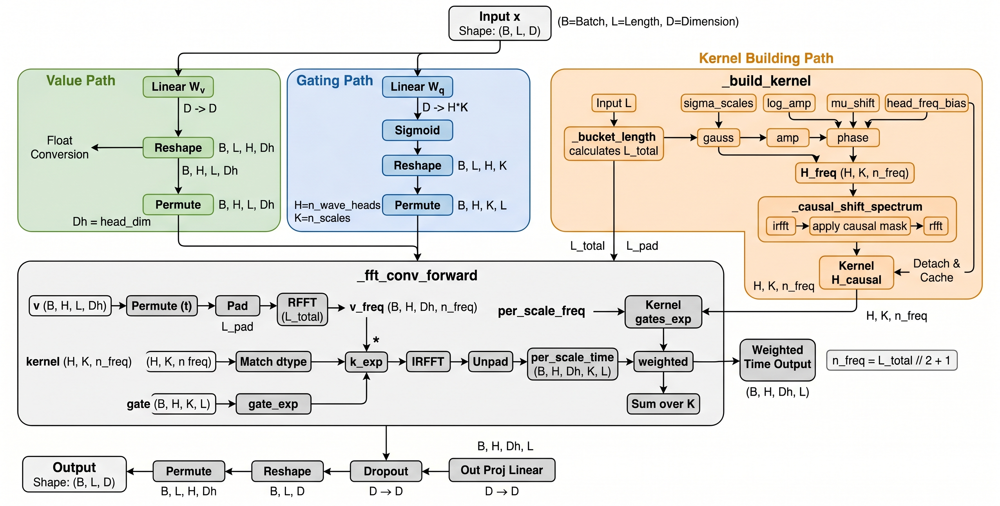
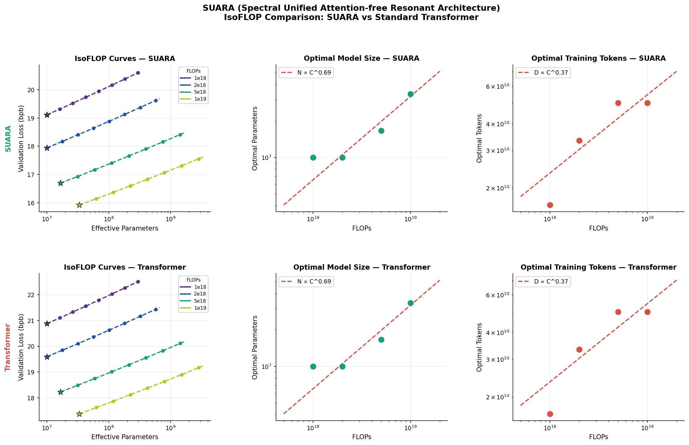
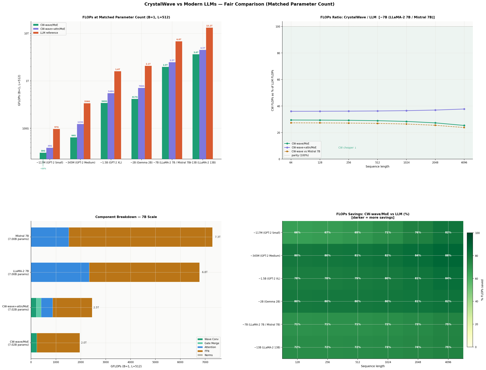

# SUARA — Spectral Universal Autoregressive Resonant Architecture

[](https://huggingface.co/AiRukua)
[](https://id.linkedin.com/in/abdul-wahid-rukua)
[](https://www.gnu.org/licenses/agpl-3.0)

SUARA is a PyTorch language modeling experiment exploring the combination of causal spectral convolution, resonant gating, and autoregressive blocks for sequence modeling. The implementation centers on the **CrystalWave** module family, with the goal of capturing local dependencies and multi-scale patterns in the frequency domain while preserving the causal property required for autoregressive language models.

## Overview

The core architecture is built from several components:

- **Crystal Wave Convolution** — processes token signals in the frequency domain using multi-scale Gaussian kernels.
- **Optional causal attention** — supports `self`, `nastar`, `gla`, or `disabled` modes.
- **Resonant gating** — adaptively blends the outputs of the wave-convolution and attention branches.
- **Feed-forward / MoE block** — enriches representation transformations after the resonance stage.

The core block lives in [arc/block.py](/home/a_rkk/paham/arc/block.py), the convolution kernel in [arc/casusal_wave_conv.py](/home/a_rkk/paham/arc/casusal_wave_conv.py), and the full model in [model/model.py](/home/a_rkk/paham/model/model.py).

## Crystal Wave Convolution

Crystal Wave Convolution is the heart of SUARA. Rather than relying solely on full attention for all token interactions, this module builds multi-scale causal kernels in the frequency domain and applies them to value representations via FFT.

The core intuition:

- Each head has several **spectral scales** represented as Gaussian filters in the frequency domain.
- Parameters like `log_amp`, `mu_shift`, and `head_freq_bias` control the amplitude and phase shift of the spectral kernels.
- Frequency kernels are converted to a **causal** form so that the output at token `t` depends only on the past.
- Signals from multiple scales are then combined using a **gate** learned from the input.

This gives the model two key advantages:

- **Multi-scale temporal mixing** — short- and medium-range patterns can be captured within a single operator.
- **Causal spectral processing** — the model remains suitable for autoregressive language modeling.

The figure below summarizes the Crystal Wave Convolution used in this repository:



## FLOPs Comparison

One of the motivations behind SUARA is to explore whether spectral mixing can provide a cheaper alternative to standard Transformer-style token mixing under comparable compute budgets. The following figure shows the FLOPs comparison between SUARA and a Transformer in the iso-FLOP setting used for this project.



To complement the iso-FLOP view, the following figure presents a fair-comparison setup between SUARA and Transformer baselines.



## Architecture

Each `CrystalWaveBlock` follows this forward pass:

1. Normalize input with `RMSNorm`.
2. Process input through `CausalWaveConv`.
3. If attention is enabled, run a parallel causal attention branch.
4. Merge the wave and attention branches via a sigmoid gate.
5. Apply the first residual connection.
6. Pass through a dense or MoE feed-forward block.
7. Apply the second residual connection and accumulate auxiliary loss if present.

The high-level data flow:

```
tokens → embedding → [CrystalWaveBlock × N] → RMSNorm → LM head
```

## Features

- Training pipeline for Hugging Face datasets.
- Local BPE tokenizer with disk caching.
- Memmap token cache for `train`, `val`, and `test` splits.
- Training loop with checkpointing, validation, sample generation, and loss curve plotting.
- Centralized YAML configuration at `data/config.yaml`.
- Support for `Muon` and `AdamW` optimizers.

## Installation

Install directly from GitHub:

```bash
pip install git+https://github.com/Airukua/SUARA.git
```

To install with visualization and tracking extras:

```bash
pip install "suara[full] @ git+https://github.com/Airukua/SUARA.git"
```

If you already cloned the repository locally, you can also install from the project root:

```bash
pip install .
```

Or install local extras:

```bash
pip install ".[full]"
```

Or directly from requirements:

```bash
pip install -r requirements.txt
```

## Training

All main training experiments run through [explore.py](/home/a_rkk/paham/explore.py). The script will:

- load the dataset from Hugging Face,
- create train/validation/test splits,
- train or load a BPE tokenizer,
- encode the corpus into a memmap cache,
- build a `CrystalWaveModel`,
- run training, validation, checkpointing, and final evaluation,
- then generate a few text samples.

### 1. Prepare the configuration

Edit [data/config.yaml](/home/a_rkk/paham/data/config.yaml) as needed. The most commonly adjusted fields:

- `dataset.name`
- `dataset.seq_len`
- `dataloader.batch_size`
- `training.max_steps`
- `training.learning_rate`
- `training.optimizer`
- `model.dim`
- `model.n_layers`
- `model.attention_mode`
- `model.n_wave_heads`
- `model.n_scales`
- `tokenizer.vocab_size`

### 2. Run training

From the repository root:

```bash
python3 explore.py
```

### 3. Training artifacts

By default, artifacts are written under `artifacts/`:

- `artifacts/dataset_cache/` — dataset cache
- `artifacts/tokenizer/` — BPE tokenizer
- `artifacts/token_cache/` — memmap token files for train/val/test
- `artifacts/checkpoints/` — `best.pt` and `last.pt` checkpoints
- `artifacts/plots/` — loss and grad norm curves

## Example Experiments

- **Wave-only language model**
  Set `attention_mode: disabled` to evaluate the capacity of Crystal Wave Convolution alone.
- **Hybrid wave + attention**
  Use `attention_mode: self`, `nastar`, or `gla` to compare resonant gating behavior.
- **Dense vs MoE**
  Toggle `ffn_mode` between `dense` and `moe` to compare efficiency and capacity.

## Practical Notes

- For modern GPUs, `precision: bf16` is generally the best choice.
- To retrain the tokenizer from scratch, set `tokenizer.retrain: true`.
- To rebuild the token cache, set `tokenizer.rewrite_cache: true`.
- To save training curves, enable `plots.enabled: true`.
- To log to Weights & Biases, enable `wandb.enabled: true`.

## Code Reference

| File | Description |
|------|-------------|
| [arc/block.py](/home/a_rkk/paham/arc/block.py) | Core `CrystalWaveBlock` |
| [arc/casusal_wave_conv.py](/home/a_rkk/paham/arc/casusal_wave_conv.py) | Crystal Wave Convolution |
| [model/model.py](/home/a_rkk/paham/model/model.py) | Full language model |
| [model/train.py](/home/a_rkk/paham/model/train.py) | Training loop |
| [data/config.yaml](/home/a_rkk/paham/data/config.yaml) | Configuration |

## Citation

```bibtex
@misc{gawa2026,
  author    = {Abdul Wahid Rukua},
  title     = {SUARA is not all you need, But at Least It's Cheap},
  year      = {2026},
  publisher = {GitHub},
  url       = {https://github.com/Airukua/gawa}
}
```

## Author

- Hugging Face: [AiRukua](https://huggingface.co/AiRukua)
- LinkedIn: [Abdul Wahid Rukua](https://id.linkedin.com/in/abdul-wahid-rukua)

## License

This project is released under the [GNU Affero General Public License v3 or later](LICENSE).
